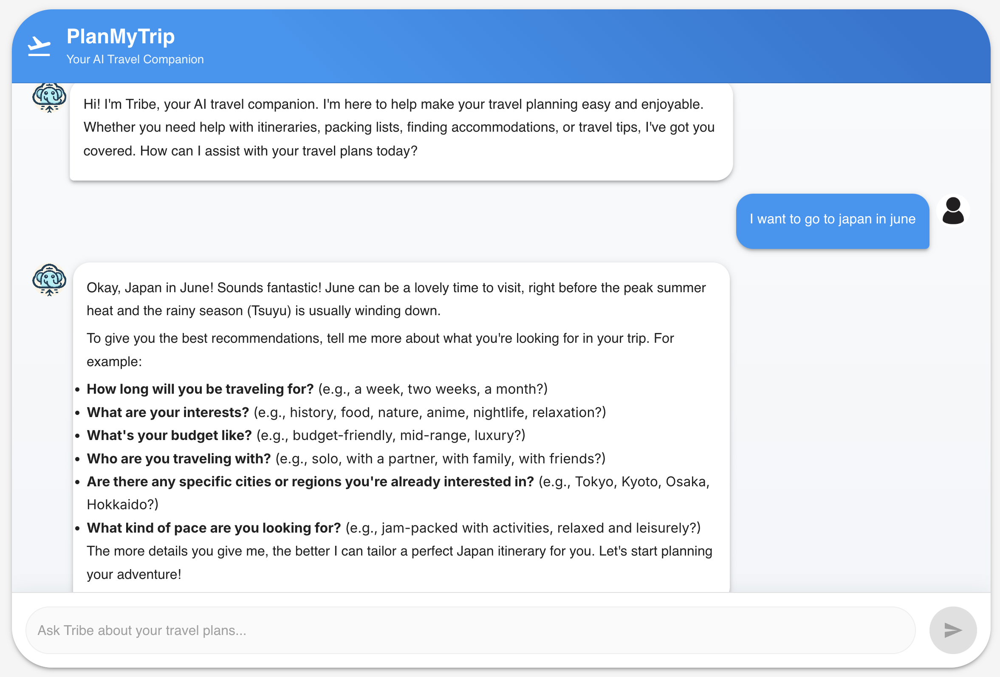

# PlanMyTrip

PlanMyTrip is a modern web application built with Next.js that helps travelers organize and plan their journeys with ease. The application provides an intuitive interface for creating, managing, and sharing trip itineraries.



## Overview

Built with the latest web technologies, PlanMyTrip offers:

- **Smart Trip Planning**: Create and organize detailed travel itineraries
- **Interactive Interface**: User-friendly design for seamless trip management
- **Modern Architecture**: Built with Next.js, TypeScript, and Material-UI
- **Responsive Design**: Fully functional across all devices and screen sizes

## Tech Stack

- **Frontend**: Next.js, React, TypeScript
- **Styling**: Material-UI, CSS Modules
- **State Management**: React Context API
- **Development**: ESLint, Prettier

## Project Structure

The project follows a modular architecture with clear separation of concerns:

```
app/
├── components/     # Reusable UI components
├── api/           # API routes
├── lib/           # Third-party library configurations
├── styles/        # Global styles and theme
├── types/         # TypeScript type definitions
├── hooks/         # Custom React hooks
├── utils/         # Utility functions
└── constants/     # Constant values and configurations
```

## Directory Purposes

- `components/`: React components that are reused across pages
- `api/`: API route handlers for backend functionality
- `lib/`: Third-party library configurations and setup
- `styles/`: Global styles, theme configurations, and CSS modules
- `types/`: TypeScript type definitions and interfaces
- `hooks/`: Custom React hooks for shared logic
- `utils/`: Helper functions and utilities
- `constants/`: Constant values, configurations, and enums

## Getting Started

1. Install dependencies:
   ```bash
   npm install
   ```

2. Run the development server:
   ```bash
   npm run dev
   ```

3. Open [http://localhost:3000](http://localhost:3000) in your browser.

4. View a live demo: [https://plan-my-trip-ai.vercel.app/](https://plan-my-trip-ai.vercel.app/) (this is without API Key)

## Environment Variables

Create a `.env.local` file in the root directory with the following variables:

```env
# Add your environment variables here
GOOGLE_API_KEY=YOUR API KEY
```